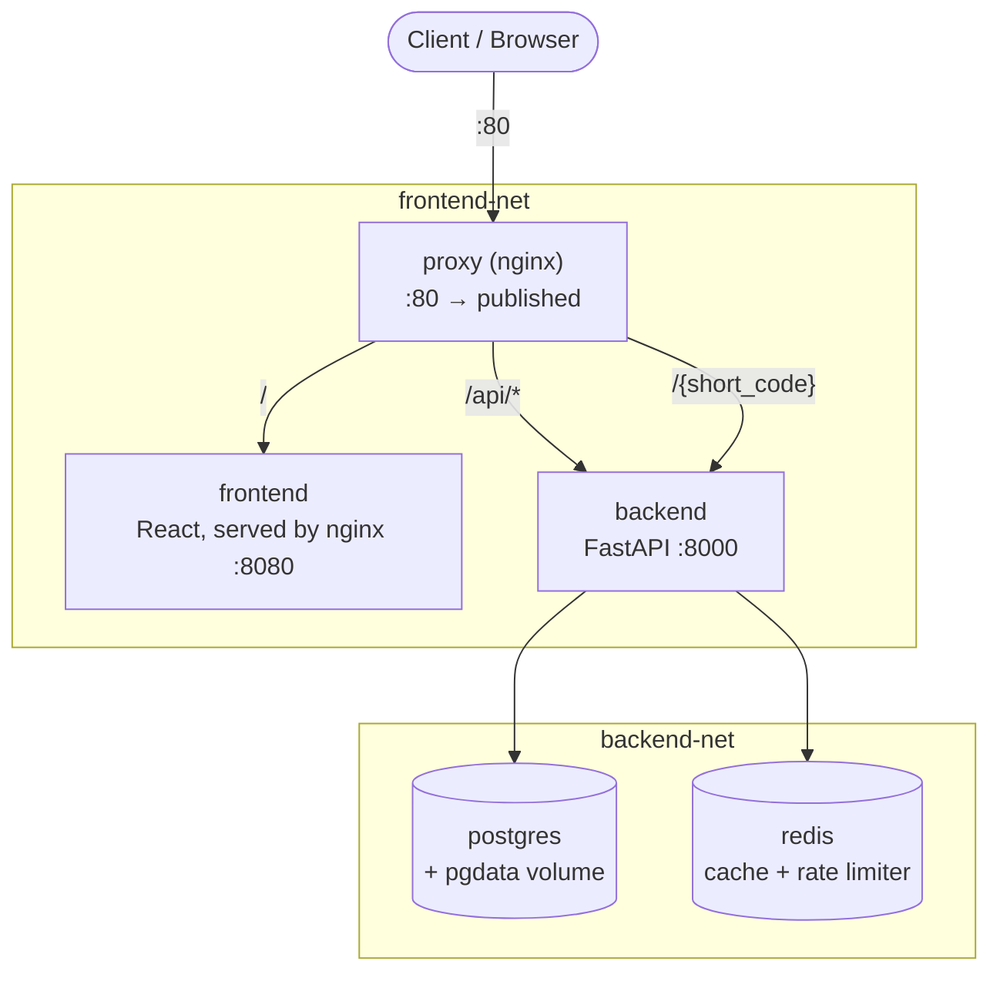

# URL Shortener + Click Analytics

A containerized URL shortener with a real click-analytics dashboard (top links, clicks over
time) and rate-limited link creation — five services (Nginx, React, FastAPI, Postgres,
Redis) behind a single entrypoint, built in phases and verified at each step. See
[BUILD_LOG.md](BUILD_LOG.md) for the full, blow-by-blow list of what broke along the way and
how it was diagnosed; this file covers the highlights.

## Prerequisites

- **Docker Desktop** (or another Docker Engine + Compose v2 setup) — and it needs to actually
  be **running** before `docker compose up` will work. If you see `failed to connect to the
  docker API at npipe:////./pipe/dockerDesktopLinuxEngine` (Windows) or a similar
  "Cannot connect to the Docker daemon" error, start Docker Desktop and wait for it to finish
  starting before retrying.
- **Docker Compose v2** — the `docker compose` subcommand (space, not hyphen). Check with
  `docker compose version`. The older standalone `docker-compose` v1 binary is not what this
  was built/tested against.
- **Ports 80, 5173, and 5432 free on your host** — nginx, the Vite dev server, and Postgres
  (dev mode only) bind to these. If something else is already listening on one of them,
  `docker compose up` will fail with a port-bind error naming the conflicting port.
- This directory itself — clone or copy it locally, then `cd` into it before running anything
  below.

## Quick start

```bash
cp .env.example .env      # edit POSTGRES_PASSWORD before anything real touches this
docker compose up --build
docker compose exec backend python seed.py   # optional: populate sample links + clicks
```

`docker compose ps` should show all five services `healthy` within a few seconds of Postgres
and Redis coming up. Plain `docker compose up` auto-loads `docker-compose.override.yml` — that
is **dev mode** — so open:

- **http://localhost:5173** — the app, via Vite's dev server (hot reload)
- **http://localhost/docs**, **http://localhost/api/...** — nginx correctly proxies these to
  the backend even in dev mode

`http://localhost/` (nginx's own route to the frontend) will 502 in dev mode — the frontend
container is running Vite on `:5173`, not nginx on `:8080`, while the override is active. This
is expected, not broken; see [Dev vs prod](#dev-vs-prod). For the nginx-fronted experience
end-to-end (including `http://localhost/`), run prod mode instead:

```bash
docker compose -f docker-compose.yml -f docker-compose.prod.yml up --build -d
```

## Architecture



Only `proxy` publishes a port to the host. Everything else is reachable only by service name,
and only from whichever network it's actually attached to:

- **frontend-net**: `proxy` ↔ `frontend`, `proxy` ↔ `backend`. The frontend container is
  *never* attached to `backend-net` — not "blocked," structurally absent. Confirmed directly
  (see [Design decisions](#why-two-networks-instead-of-one)): from inside the frontend
  container, both DNS resolution of `postgres`/`redis` and a raw-IP connection attempt to
  Postgres's real address fail — the first with "bad address" (no route to even look up), the
  second with a timeout (no path between the two Docker networks at all).
- **backend-net**: `backend` ↔ `postgres`, `backend` ↔ `redis`. `backend` is the only
  container attached to both networks — it's the sole bridge between the two.

nginx routes three ways, not the two the brief describes, because a bare `GET /{short_code}`
redirect is neither `/` nor `/api/*` — see [Design decisions](#why-a-third-route-for-short-codes).

## Features

- Create, list, update, and delete short links (`/api/links`)
- `GET /{short_code}` redirect, backed by a Redis cache with a 24h TTL
- Rate-limited link creation (fixed-window counter in Redis)
- Click analytics: top links by click count, clicks-over-time (last N days)
- Sample data via `seed.py` so a fresh clone shows a populated dashboard immediately

## Project layout

```
.
├── docker-compose.yml            # base: postgres, redis, backend, frontend, proxy
├── docker-compose.override.yml   # dev-only, auto-loaded: hot reload, exposed pg port
├── docker-compose.prod.yml       # prod-only, explicit: resource limits
├── .env.example
├── BUILD_LOG.md                  # full running log of what broke and why
├── backend/
│   ├── Dockerfile                # multi-stage, non-root
│   ├── requirements.txt
│   ├── seed.py
│   └── app/
│       ├── main.py
│       ├── routers/ (links.py, analytics.py, health.py)
│       ├── models.py             # SQLAlchemy models (mapped onto db/init.sql, not create_all)
│       ├── schemas.py
│       ├── db.py
│       ├── cache.py              # Redis client + redirect-cache/rate-limit helpers
│       └── config.py
├── frontend/
│   ├── Dockerfile                # multi-stage (Vite build → nginx), non-root
│   ├── nginx.conf                # static file serving only, no proxying
│   ├── docker-entrypoint.d/      # generates config.js from API_BASE_URL at container start
│   └── src/
├── proxy/
│   ├── Dockerfile                # non-root, no build stage needed (just config)
│   └── nginx.conf                # the reverse proxy: / , /api/*, and short-code redirects
└── db/
    └── init.sql                  # links + clicks schema — the single source of truth
```

## Dev vs prod

**Dev** (default — `docker compose up --build`): `docker-compose.override.yml` loads
automatically. Backend runs with `--reload` against a bind-mounted `app/`; frontend runs
Vite's own dev server (HMR) on `:5173` instead of the built nginx image, with its dev-server
proxy mirroring nginx's `/api` and short-code routing so link clicks behave the same way;
Postgres's port is exposed for local `psql`. In this mode, nginx's own `/` route (port 80 →
frontend) stops working, because the frontend container's process is now Vite on `:5173`, not
nginx on `:8080` — this is intentional (see [BUILD_LOG.md](BUILD_LOG.md), Phase 5), not a bug.

**Prod**: explicit, without the override —

```bash
docker compose -f docker-compose.yml -f docker-compose.prod.yml up --build -d
```

Adds CPU/memory limits per service. No port changes needed there — the base file already
publishes nothing but nginx.

## Design decisions

### Why Postgres over Mongo/SQLite here

The core data is inherently relational — a `link` has many `clicks`, and the two analytics
views that make this more than a toy (top links, clicks over time) are both straightforward
`GROUP BY` queries across that foreign key. Modeling that in Mongo would mean either
duplicating link data into every click document or doing application-side joins; modeling it
in SQLite would work for a demo but doesn't carry the same "I understand a real datastore"
signal that Postgres does, and Postgres's `docker-entrypoint-initdb.d` mechanism made the
schema-as-code story (`db/init.sql`) clean besides.

### Why Redis is doing two specific jobs, not just "added"

1. **Redirect cache** (`short_code → long_url`, 24h TTL): reads massively outnumber writes for
   any URL shortener, and a redirect is the one place where latency is actually user-visible —
   so cache-first-then-write-through on miss is the textbook justification, not decoration.
   Verified with actual log lines (`cache MISS` then `cache HIT` on the second request to the
   same code), not just by reading the code.
2. **Rate limiting** (fixed-window `INCR`+`EXPIRE` on link creation): a second, unrelated use
   of the same dependency — specifically to avoid the "Redis because the list said so"
   critique. It also turned out to need a real fix once nginx entered the picture: see
   [Design decisions → what broke](#one-concrete-thing-that-broke).

Click events themselves are still a straight write to Postgres — no queue. Section 10 of the
original plan calls out a Redis-backed queue as a legitimate stretch goal, but it would be
over-engineered relative to the traffic this app actually sees, and it's more honest to say so
than to build it for show.

### Why two networks instead of one

The plan's brief specifically calls out network understanding as something to demonstrate, and
one flat default network — the thing every copy-pasted `docker-compose.yml` has — proves
nothing. Splitting into `frontend-net` (nginx + frontend + backend) and `backend-net` (backend
+ postgres + redis), with backend as the only container on both, means the frontend container
has no path to the database or cache at all, not merely a firewalled one. This was verified
directly, not assumed: `docker inspect` confirms network membership, and from inside the
frontend container, `wget http://postgres:5432` fails with `bad address` — DNS resolution
itself fails, because there's no route to even look up — and a raw-IP connection attempt to
Postgres's actual `backend-net` address times out. A positive control (the same request from
`backend`, which *is* on `backend-net`) succeeds, proving the isolation is the network split
working as designed, not some unrelated connectivity problem.

### Why a third route for short-codes

The plan's own routing shorthand — "`/` → frontend, `/api` → backend" — has no slot for a bare
`GET /{short_code}` redirect, and that's not a nitpick: routing it to `/` would mean nginx
serves the React app's `index.html` for every short link instead of actually redirecting,
silently breaking the app's one core feature the moment nginx is introduced. `proxy/nginx.conf`
adds a third `location`, a regex matching a single 3-16 character alphanumeric path segment
(matching the same length the backend enforces and generates), checked before the frontend
catch-all. The traded-off cost, stated plainly rather than glossed over: this reserves all
single-segment top-level paths for short codes. `/health` is one such path, and happens to
still resolve correctly — but only because FastAPI matches routes in registration order and
`health.router` is included before the redirect route, not because nginx treats it specially.
A link with `short_code="health"` would be silently unreachable via redirect, permanently
shadowed by the literal route. `/docs`, `/redoc`, and `/openapi.json` needed an actual fix, not
just a lucky ordering: `openapi.json` contains a `.`, so it doesn't match the short-code regex
at all and was falling through to the frontend's SPA catch-all — Swagger UI at `/docs` loaded
its HTML shell but silently failed to fetch the real schema. Fixed with three explicit
exact-match `location` blocks in `proxy/nginx.conf`, which nginx always checks before any
prefix or regex location. Net effect: `health`, `docs`, `redoc`, and `openapi.json` are now
reserved short codes by construction, not by accident — not fixed further (reserving codes at
creation time is bigger than this phase's scope) but no longer silently broken either. Full
reasoning in [BUILD_LOG.md](BUILD_LOG.md), Phase 4, 5, and 6.

### One concrete thing that broke

The frontend's Docker healthcheck (`wget http://localhost:8080/`) failed every single retry
with "Connection refused" — while the app was demonstrably working: `curl` from the host
succeeded, `docker compose exec frontend ps` showed nginx running, and `netstat` inside the
container showed it listening on `0.0.0.0:8080`. The healthcheck and reality disagreed.

Diagnosis: `docker compose exec frontend cat /etc/hosts` showed `::1 localhost` listed before
`127.0.0.1 localhost`, and nginx's `listen 8080;` only binds the IPv4 socket. Busybox `wget` —
unlike `curl`, which tries every resolved address in turn until one connects — only attempts
the first address `getaddrinfo` returns and gives up. So `wget http://localhost:8080/` tried
`[::1]:8080` first, found nothing listening, and reported "connection refused" without ever
trying `127.0.0.1`. Fixed by pointing the healthcheck at `http://127.0.0.1:8080/` explicitly
instead of relying on hostname resolution order. The backend's own healthcheck uses `curl` and
never hit this — the same "use `localhost` in a container healthcheck" habit silently works
with one client and silently fails with another, depending entirely on which binary happens to
be in the base image. Several more things broke or needed non-obvious fixes across the other
phases (a Docker-stage metadata gotcha with the dev-mode healthcheck, an nginx config parse
error from an unquoted regex, rate limiting silently going global once nginx fronted
everything, a cache-invalidation gap when bypassing the API) — the complete list, in the order
they were actually hit, is in [BUILD_LOG.md](BUILD_LOG.md).

## Known limitations

- **Reserved short codes.** `health`, `docs`, `redoc`, `openapi.json`, and bare `api` will
  never be reachable as short-link redirects — they're claimed by real routes, either at the
  nginx layer (explicit exact-match locations) or by FastAPI's route registration order. See
  [Why a third route for short-codes](#why-a-third-route-for-short-codes).
- **`expires_at` is stored but not enforced.** The column exists per the data model; nothing
  currently checks it at redirect time. Left out deliberately rather than built speculatively.
- **Direct database writes bypass the Redis cache.** Only the API's own `PUT`/`DELETE`
  handlers invalidate a link's cached redirect. A manual `psql` edit or future admin script
  needs to also clear the corresponding `link:{short_code}` key, or accept staleness up to the
  24h TTL.
- **Not visually verified in a real browser.** Every phase was verified via `curl`/`docker
  exec`/log inspection since no browser automation tool was available in this build session —
  worth clicking through `http://localhost` by hand before treating the UI as fully proven.

## Environment variables (`.env.example`)

| Variable | Default | Used by | Notes |
|---|---|---|---|
| `POSTGRES_USER` | `shortener` | postgres, backend | |
| `POSTGRES_PASSWORD` | `changeme_in_env` | postgres, backend | **change this** — never commit a real value |
| `POSTGRES_DB` | `shortener` | postgres, backend | |
| `POSTGRES_PORT` | `5432` | postgres (dev override only) | Not published in the base compose file — only `docker-compose.override.yml` re-exposes it, for local `psql` |
| `RATE_LIMIT_MAX` | `5` | backend | Max link-creation requests per window, per client IP |
| `RATE_LIMIT_WINDOW_SECONDS` | `60` | backend | Fixed-window size for the rate limiter |
| `NGINX_PORT` | `80` | proxy | The only port published to the host in any mode |

`POSTGRES_HOST`, `POSTGRES_PORT` (backend's internal value), `REDIS_HOST`, `REDIS_PORT`, and
`API_BASE_URL` are set directly in `docker-compose.yml`'s `environment:` blocks rather than
`.env` — they're wiring between containers on the same Docker network, not deployment-specific
secrets or ports, so hardcoding the service name (`postgres`, `redis`) there isn't the kind of
hardcoding `.env` exists to prevent.
